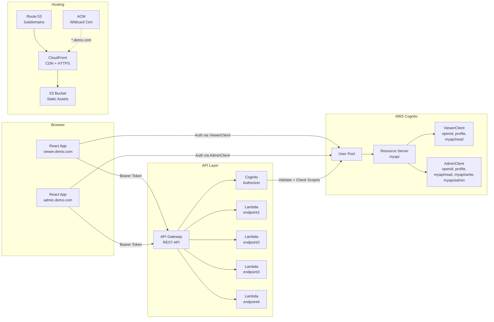
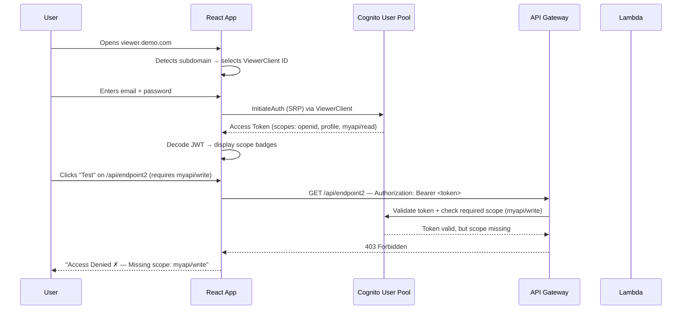

# Architecture

## Overview

This project demonstrates **scope-based authorization** using AWS Cognito custom OAuth scopes. A single user authenticates through different Cognito app clients and receives different access tokens — each containing a distinct set of scopes that API Gateway enforces at the method level.

---

## System Diagram



---

## Authentication Flow



---

## Component Breakdown

### AWS Services

| Service | Role |
|---|---|
| **Cognito User Pool** | User directory, authentication, token issuance. Houses the custom resource server and both app clients. |
| **Resource Server** | Defines the `myapi` identifier and custom scopes (`read`, `write`, `admin`). |
| **API Gateway (REST)** | Exposes 4 endpoints. Each method is configured with a Cognito Authorizer and a list of required OAuth scopes. |
| **Lambda** | Simple handler functions behind each endpoint. Return `200 OK` with a JSON message. Scope enforcement happens at the Gateway level, not inside Lambda. |
| **S3** | Hosts the static React build (`dist/`). |
| **CloudFront** | CDN distribution fronting the S3 origin. Provides HTTPS via ACM certificate. |
| **Route 53** | DNS records for `viewer.yourdemo.com` and `admin.yourdemo.com`, both pointing to CloudFront. |
| **ACM** | Wildcard TLS certificate (`*.yourdemo.com`) attached to CloudFront. |
| **IAM** | Execution roles for Lambda, deploy roles for GitHub Actions. |

### Frontend Components

| Component | Responsibility |
|---|---|
| `AuthContext` | Manages user state, login/logout, role switching. Stores session in `localStorage`. |
| `Auth` page | Login/Register tabs with form validation and demo-credential auto-fill. |
| `Dashboard` page | Displays scope badges, role-switch buttons, and the endpoint tester grid. |
| `EndpointCard` | Fires test requests, shows ✓ Allowed or ✗ Access Denied with expandable details (Authorization header, response body). |
| `ProtectedRoute` | Guards the dashboard — redirects unauthenticated users to login. |

---

## Data Flow

1. **Subdomain detection** — React reads `window.location.hostname` to determine whether the user is on the Viewer or Admin subdomain and selects the corresponding Cognito app client ID.
2. **Authentication** — The app uses SRP (Secure Remote Password) auth via the selected client. Cognito returns an access token containing only the scopes allowed for that client.
3. **Token storage** — Tokens are stored in-memory (or `localStorage` for the demo). The access token JWT is decoded client-side to extract and display scopes.
4. **API calls** — Each endpoint card sends a request with `Authorization: Bearer <access_token>`. API Gateway's Cognito Authorizer validates the token and checks the method's required scopes.
5. **Enforcement** — If the token's scopes satisfy the method requirement → `200 OK` from Lambda. If not → `403 Forbidden` from API Gateway (before Lambda is even invoked).

---

## Scope Enforcement Model

```
┌─────────────────────────────────────────────────────────┐
│                    Cognito User Pool                     │
│                                                         │
│  Resource Server: myapi                                 │
│  ├── myapi/read                                         │
│  ├── myapi/write                                        │
│  └── myapi/admin                                        │
│                                                         │
│  ViewerClient  → allowed: openid, profile, myapi/read   │
│  AdminClient   → allowed: openid, profile, myapi/read,  │
│                           myapi/write, myapi/admin       │
└─────────────────────────────────────────────────────────┘
                         │
                    Access Token
                         │
                         ▼
┌─────────────────────────────────────────────────────────┐
│                    API Gateway                           │
│                                                         │
│  GET  /api/endpoint1  → requires: myapi/read            │
│  POST /api/endpoint2  → requires: myapi/write           │
│  PUT  /api/endpoint3  → requires: myapi/write           │
│  DEL  /api/endpoint4  → requires: myapi/admin           │
└─────────────────────────────────────────────────────────┘
```

---

## Infrastructure-as-Code (Terraform)

All resources are provisioned via Terraform with a remote S3 backend for state management and DynamoDB for state locking. Planned module structure:

```
terraform/
├── backend.tf            # Remote state (S3 + DynamoDB)
├── main.tf               # Root module composition
├── variables.tf          # Input variables
├── outputs.tf            # Exported values (pool ID, client IDs, API URL)
├── modules/
│   ├── cognito/          # User pool, resource server, app clients
│   ├── api-gateway/      # REST API, methods, Cognito authorizer
│   ├── lambda/           # Function code, IAM roles
│   ├── hosting/          # S3 bucket, CloudFront, ACM cert
│   └── dns/              # Route 53 records for subdomains
```

---

## References

- [Cognito Resource Servers](https://docs.aws.amazon.com/cognito/latest/developerguide/cognito-user-pools-define-resource-servers.html)
- [API Gateway Cognito Authorizer](https://docs.aws.amazon.com/apigateway/latest/developerguide/apigateway-integrate-with-cognito.html)
- [CloudFront + S3 Origin](https://docs.aws.amazon.com/AmazonCloudFront/latest/DeveloperGuide/DownloadDistS3AndCustomOrigins.html)
