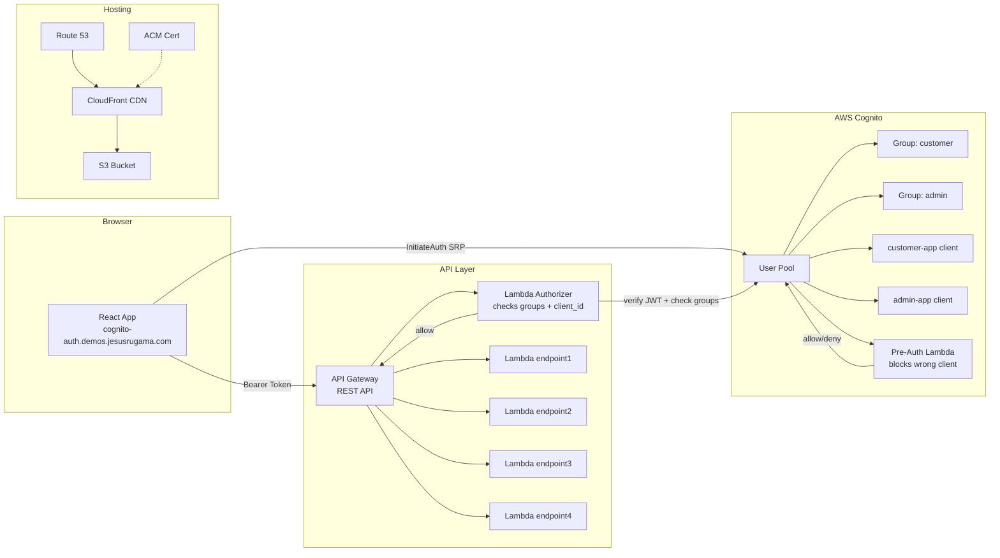
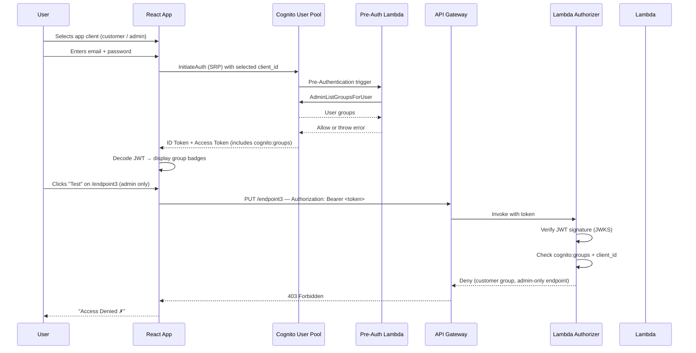

# Architecture

## Overview

This project demonstrates **groups-based authorization** using AWS Cognito. Users authenticate through a custom login form (no Hosted UI) using one of two app clients. A Lambda authorizer on API Gateway reads `cognito:groups` and `client_id` from the JWT to enforce per-endpoint access rules.

---

## System Diagram



---

## Authentication Flow



---

## Component Breakdown

### AWS Services

| Service | Role |
|---|---|
| **Cognito User Pool** | User directory, authentication, token issuance. Contains two groups (`customer`, `admin`) and two app clients. |
| **Pre-Authentication Lambda** | Invoked before password validation. Blocks users from logging in through the wrong app client. |
| **API Gateway (REST)** | Exposes 4 endpoints. Each method uses a Lambda authorizer for access control. |
| **Lambda Authorizer** | Verifies the JWT signature using Cognito's JWKS, reads `cognito:groups` and `client_id`, and returns allow/deny. |
| **Lambda (endpoints)** | Simple handlers returning `200 OK` with JSON. Authorization happens at the Gateway level before Lambda is invoked. |
| **S3** | Hosts the static React build (`dist/`). |
| **CloudFront** | CDN fronting S3. Provides HTTPS via ACM certificate. |
| **Route 53** | DNS record for `cognito-auth.demos.jesusrugama.com`. |
| **ACM** | TLS certificate attached to CloudFront. |
| **IAM** | Execution role for all Lambda functions. |

### Frontend Components

| Component | Responsibility |
|---|---|
| `AuthContext` | Manages Cognito SRP login/logout via `amazon-cognito-identity-js`. Stores tokens in memory. |
| `Auth` page | Login form with app client selector (Customer / Admin). |
| `Dashboard` page | Displays group badges, app client switcher, and endpoint tester grid. |
| `EndpointCard` | Fires test requests with Bearer token, shows ✓ Allowed or ✗ Access Denied. |
| `ProtectedRoute` | Guards the dashboard — redirects unauthenticated users to login. |

---

## Data Flow

1. **App client selection** — User picks Customer or Admin app client at login. The frontend uses the corresponding Cognito `client_id` for `InitiateAuth`.
2. **Pre-Authentication** — Cognito invokes the Pre-Auth Lambda before validating the password. The Lambda calls `AdminListGroupsForUser` and blocks the login if the user's group doesn't match the app client.
3. **Token issuance** — Cognito returns tokens. The ID/Access token automatically includes `cognito:groups` — no custom claims needed.
4. **Token storage** — Tokens stored in memory (via `amazon-cognito-identity-js` session). Decoded client-side to display group badges.
5. **API calls** — Each endpoint card sends `Authorization: Bearer <token>`. The Lambda authorizer verifies the JWT and checks groups + client_id.
6. **Enforcement** — Group allowed + client allowed → `200 OK` from Lambda. Otherwise → `403 Forbidden` from API Gateway.

---

## Authorization Model

```
┌─────────────────────────────────────────────────────────┐
│                    Cognito User Pool                     │
│                                                         │
│  Groups: customer, admin                                │
│  App Clients: customer-app, admin-app                   │
│                                                         │
│  JWT includes: cognito:groups, client_id automatically  │
└─────────────────────────────────────────────────────────┘
                         │
                    Bearer Token
                         │
                         ▼
┌─────────────────────────────────────────────────────────┐
│                  Lambda Authorizer                       │
│                                                         │
│  1. Verify JWT signature (Cognito JWKS)                 │
│  2. Read cognito:groups + client_id from token          │
│  3. Check endpoint permission map:                      │
│                                                         │
│  /endpoint1 → customer | admin, any client              │
│  /endpoint2 → customer | admin, any client              │
│  /endpoint3 → admin only, admin-app client              │
│  /endpoint4 → admin only, admin-app client              │
└─────────────────────────────────────────────────────────┘
```

---

## Pre-Authentication Flow

The Pre-Auth Lambda prevents users from obtaining tokens through the wrong app client:

```
User submits login
       ↓
Cognito receives InitiateAuth request
       ↓
Cognito invokes Pre-Authentication Lambda
       ↓
Lambda calls AdminListGroupsForUser
       ↓
  customer-app + admin user   → ❌ blocked (admin must use admin-app)
  admin-app + non-admin user  → ❌ blocked (only admins on admin-app)
  customer-app + customer     → ✅ allowed
  admin-app + admin           → ✅ allowed
  customer-app + admin        → ✅ allowed (admin can use customer app at customer level)
       ↓
  Allow → Cognito validates password → token issued
  Deny  → Cognito rejects login entirely
```

---

## When to Use Other Patterns

| Requirement | Solution |
|---|---|
| Groups-based access (this demo) | `cognito:groups` in JWT + Lambda authorizer |
| Block users from wrong app client | Pre-Authentication Lambda trigger |
| Per-user or per-resource permissions | Amazon Verified Permissions (AVP) + Cedar policies |
| Federated login (Google, etc.) | Cognito Identity Federation + Post Confirmation trigger for group assignment |
| Machine-to-machine auth | Client Credentials grant (no user involved) |

---

## Design Decisions

### Custom UI over Hosted UI

**Context:** Needed to demo first-party multi-app authorization with two app clients.

**Decision:** Custom login form with SRP authentication.

**Alternatives considered:** Cognito Hosted UI with OAuth flows and scopes.

**Rationale:** Hosted UI and OAuth scopes are designed for *delegation*—authorizing third-party apps to act on behalf of users ("Login with Google", B2B SSO, external integrations). For first-party apps we control, this model is unnecessary overhead. Custom UI with SRP gives direct authentication without redirects, full branding control, and works naturally with the two-app-client pattern where the same user gets different permissions based on which portal they enter.

**Tradeoff accepted:** More code to maintain (AuthContext, forms, error handling), but the right authorization model for the use case.

---

### Lambda Authorizer over Cognito Authorizer

**Context:** Authorization requires checking both `cognito:groups` AND `client_id` per endpoint.

**Decision:** Custom Lambda authorizer that inspects JWT claims.

**Alternatives considered:** API Gateway's built-in Cognito User Pool authorizer.

**Rationale:** The Cognito authorizer only validates token authenticity ("is this JWT valid and from my User Pool?"). It cannot inspect claims like `cognito:groups` or `client_id`, nor make per-endpoint authorization decisions. For the `group ∩ client_id → permission` pattern, a Lambda authorizer was *required*, not a simplification.

**Tradeoff accepted:** ~50ms added latency per request, plus Lambda invocation cost. Acceptable for the authorization granularity gained.

---

### Groups-based RBAC over Scopes

**Context:** Initially considered OAuth scopes for permission control.

**Decision:** Cognito groups with group claims in JWT.

**Alternatives considered:** OAuth scopes via Hosted UI authorization flows.

**Rationale:** Scopes answer "what can this *application* do on behalf of the user?" Groups answer "what can this *user* do?" For first-party apps, we're not delegating authority to a third party—we're directly authorizing users. Groups map cleanly to business roles (customer, admin) and work with custom UI + SRP. Scopes would require Hosted UI and OAuth flows, which don't fit the first-party multi-app scenario.

---

### Groups-based RBAC over Cedar/AVP

**Context:** Needed to control access to API endpoints by role.

**Decision:** Cognito groups with Lambda authorizer checking group claims.

**Alternatives considered:** Amazon Verified Permissions (AVP) with Cedar policies.

**Rationale:** Cedar excels at *resource-level* authorization ("can user X edit resource Y?") with complex conditions (attributes, relationships, time-based rules). This demo has no resources—just endpoints gated by role. Groups are the *correct* abstraction for endpoint-level RBAC, not a simplification.

**When Cedar would apply:** If extended to resource-level permissions (e.g., "users can only modify their own profile", "admins can approve orders under $10k"), Cedar's policy model would become valuable. For endpoint-level access control, it's unnecessary complexity.

---

## Security Considerations

### What This Design Mitigates

| Threat | Mitigation |
|--------|------------|
| **Token theft via XSS** | Tokens stored in memory only, not localStorage—inaccessible to injected scripts after page refresh |
| **Password interception** | SRP protocol ensures password never leaves the client; only proof-of-knowledge is transmitted |
| **Client spoofing** | Pre-Auth Lambda validates that user's group matches the app client before token issuance |
| **Token reuse across apps** | Lambda authorizer checks both `cognito:groups` AND `client_id`—token from customer-app cannot access admin endpoints |
| **JWT forgery** | RS256 signature verification against Cognito's JWKS; tokens signed by Cognito's private key only |
| **Issuer confusion** | Authorizer validates `iss` claim matches expected Cognito User Pool URL |

### Security Boundaries

```
┌─────────────────────────────────────────────────────────────────┐
│  Boundary 1: Cognito Pre-Auth                                   │
│  "Can this user get a token from this app client?"              │
│  → Blocks non-admin users from obtaining admin-app tokens       │
└─────────────────────────────────────────────────────────────────┘
                              ↓
┌─────────────────────────────────────────────────────────────────┐
│  Boundary 2: Lambda Authorizer                                  │
│  "Can this token access this endpoint?"                         │
│  → Validates signature, issuer, group membership, client_id     │
└─────────────────────────────────────────────────────────────────┘
                              ↓
┌─────────────────────────────────────────────────────────────────┐
│  Boundary 3: API Gateway                                        │
│  "Allow or Deny based on authorizer policy"                     │
│  → Enforces the IAM policy returned by authorizer               │
└─────────────────────────────────────────────────────────────────┘
```

### Not Addressed (Out of Scope)

- **DDoS protection** — No WAF configured; relies on API Gateway throttling only
- **Audit logging** — Authorization decisions not logged; no trail for security review
- **Secret rotation** — No automated rotation of any credentials
- **CORS hardening** — Allows configured origins but no additional origin validation

---

## Limitations

This is an educational demo, not production-ready. Known gaps:

| Gap | Impact | Production Fix |
|-----|--------|----------------|
| **No automated tests** | Regression risk on changes | Add unit tests for authorizer logic and E2E tests for auth flows |
| **No observability** | Auth failures are invisible—Lambda authorizer doesn't log decisions to CloudWatch | Add structured logging for all allow/deny decisions with context |
| **JWKS caching without TTL** | Keys cached indefinitely; silent failure if Cognito rotates signing keys | Implement cache invalidation with TTL or on verification failure |
| **Single region** | No disaster recovery or failover | Multi-region User Pool with Route 53 failover |
| **No token refresh handling** | Users re-authenticate when tokens expire | Add silent refresh in the client before token expiry |
| **No rate limiting on auth** | Vulnerable to credential stuffing | Enable Cognito advanced security features or WAF rules |

---

## Infrastructure (Terraform)

```
terraform/
├── backend.tf        # Remote state (S3 + DynamoDB)
├── cognito.tf        # User Pool, Groups, App Clients, Pre-Auth Lambda
├── api_gateway.tf    # REST API, methods, Lambda authorizer
├── lambda.tf         # Endpoint Lambda functions + IAM role
├── lambda_iam.tf     # IAM role definition
├── variables.tf      # Input variables
├── outputs.tf        # User Pool ID, Client IDs, API URL
├── s3.tf             # Static hosting bucket
├── cloudfront.tf     # CDN distribution
├── route53.tf        # DNS records
└── acm.tf            # TLS certificate
```

---

## References

- [Cognito User Pool Groups](https://docs.aws.amazon.com/cognito/latest/developerguide/cognito-user-pools-user-groups.html)
- [API Gateway Lambda Authorizer](https://docs.aws.amazon.com/apigateway/latest/developerguide/apigateway-use-lambda-authorizer.html)
- [Cognito Pre-Authentication Trigger](https://docs.aws.amazon.com/cognito/latest/developerguide/user-pool-lambda-pre-authentication.html)
- [CloudFront + S3 Origin](https://docs.aws.amazon.com/AmazonCloudFront/latest/DeveloperGuide/DownloadDistS3AndCustomOrigins.html)
